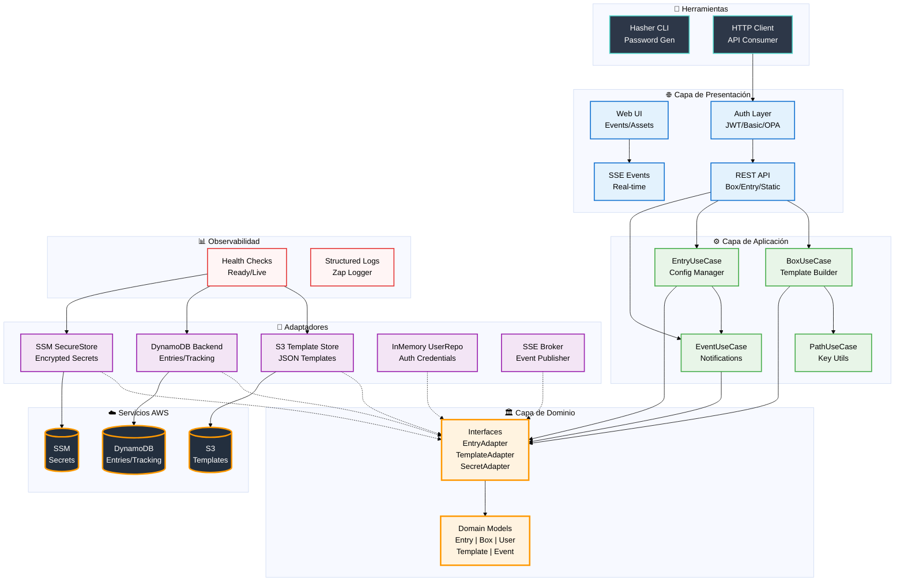

# NBOX: Gestión Centralizada de Configuraciones y Secretos

NBOX es un servicio backend escrito en Go, diseñado para actuar como una solución centralizada y segura para la administración de variables de entorno, secretos y plantillas de configuración en entornos de desarrollo modernos.

---

## Características Principales

-   **Almacén Centralizado**: Gestiona variables y secretos para múltiples servicios y entornos (desarrollo, QA, producción) desde un único lugar.
-   **Integración Nativa con AWS**:
  -   **Variables**: Almacenadas en **AWS DynamoDB**, con historial de cambios para auditoría.
  -   **Secretos**: Guardados de forma segura en **AWS Parameter Store** utilizando una clave de cifrado propia de **AWS KMS**.
  -   **Plantillas**: Versionadas y almacenadas en **AWS S3** (por ejemplo, definiciones de tareas de ECS, archivos de configuración, etc.).
-   **Procesamiento Dinámico de Plantillas**: Reemplaza variables (`{{...}}`) y marcadores de posición (`:...`) dentro de las plantillas al momento de solicitarlas, permitiendo la generación de configuraciones dinámicas.
-   **Seguridad Robusta**:
  -   **Autenticación**: Soporta tanto **HTTP Basic Auth** como **JWT** para proteger los endpoints.
  -   **Autorización**: Utiliza **Open Policy Agent (OPA)** para un control de acceso granular y basado en roles.

---

## Guía de Inicio Rápido

### Prerrequisitos

-   Go 1.24+
-   Docker
-   Credenciales de AWS configuradas en el entorno.

### Instalación y Ejecución Local

1.  **Clonar el repositorio**:
    ```shell
    git clone <tu-repositorio>
    cd nbox
    ```

2.  **Configurar variables de entorno**:
    Crea un archivo `.env` o exporta las siguientes variables. Consulta la sección de **Configuración** para más detalles.
    ```ini
    export AWS_REGION=us-east-1
    export NBOX_ENTRIES_TABLE_NAME=nbox-entries-development
    export NBOX_BOX_TABLE_NAME=nbox-box-development
    export NBOX_BUCKET_NAME=tu-bucket-nbox-development
    export NBOX_BASIC_AUTH_CREDENTIALS='{"user":{"password": "$2a$10$...", "roles": ["admin"], "status": "active"}}'
    ```
    > **Nota**: Para generar el hash de la contraseña, puedes usar la herramienta `hasher` incluida en `cmd/hasher`.

3.  **Instalar dependencias y herramientas**:
    ```shell
    make install-all-deps tools
    ```

4.  **Ejecutar el servicio**:
    ```shell
    go run cmd/nbox/main.go
    ```
    El servicio estará disponible en `http://localhost:7337`.

---

## Referencia de la API

A continuación se muestran los endpoints principales y ejemplos de uso.

### Autenticación

#### **`POST /api/auth/token`**
Genera un token JWT para autenticar las siguientes peticiones.

```shell
curl -X POST -H "Content-Type: application/json" \
  -d '{"username": "user", "password": "pass"}' \
  http://localhost:7337/api/auth/token
```

### Gestión de Variables (Entries)

#### `POST /api/entry`
Crea o actualiza un lote de variables. Si secure es true, el valor se almacena en AWS Parameter Store.

```shell
PAYLOAD='[
   { "key": "global/example/email_password", "value": "super-secret-password", "secure": true },
   { "key": "global/example/email_user", "value": "test@gmail.com" }
]'

curl -X POST -v "http://localhost:7337/api/entry" \
    -H "Content-Type: application/json" \
    -d "${PAYLOAD}" \
    --user "user:pass"
```

#### `GET /api/entry/prefix?v=<path>`
Lista todas las variables bajo un prefijo (ej: `stage/service`)

```shell
curl -X GET "http://localhost:7337/api/entry/prefix?v=global/example" \
    --user "user:pass" | jq
```

#### `GET /api/entry/key?v=<full-key-path>`
Obtiene el valor de una variable específica.

```shell
curl -X GET "http://localhost:7337/api/entry/key?v=global/example/email_user" \
    --user "user:pass" | jq
```

#### `GET /api/entry/secret-value?v=<full-key-path>`
Obtiene el valor de un secreto específico.

```shell
curl -X GET "http://localhost:7337/api/entry/secret-value?v=global/example/email_password" \
    --user "user:pass" | jq
```

#### `GET /api/entry/export`
Exporta todas las variables bajo un prefijo en diferentes formatos (JSON, YAML, dotenv, ECS Task Definition). Útil para respaldos, migraciones o integración con otros sistemas.

**Parámetros:**
- `prefix` (requerido): Prefijo para filtrar las variables a exportar
- `format` (opcional): Formato de salida. Valores: `json`, `yaml`, `dotenv`, `ecs`. Por defecto: `json`

**Formatos disponibles:**
- `json`: Exporta como array JSON con todos los campos
- `yaml`: Exporta en formato YAML
- `dotenv`: Exporta como archivo `.env` (KEY=VALUE)
- `ecs`: Exporta como definición de variables de entorno para ECS Task Definition

**Ejemplo - Exportar como JSON:**
```shell
curl -X GET "http://localhost:7337/api/entry/export?prefix=production/myapp&format=json" \
    --user "user:pass" -o backup.json
```

**Ejemplo - Exportar como .env:**
```shell
curl -X GET "http://localhost:7337/api/entry/export?prefix=development/myapp&format=dotenv" \
    --user "user:pass" -o .env
```

**Ejemplo - Exportar como YAML:**
```shell
curl -X GET "http://localhost:7337/api/entry/export?prefix=staging/myapp&format=yaml" \
    --user "user:pass" -o config.yaml
```

**Ejemplo - Exportar para ECS Task Definition:**
```shell
# Este formato genera el array de environment variables listo para usar en ECS
curl -X GET "http://localhost:7337/api/entry/export?prefix=production/myapp&format=ecs" \
    --user "user:pass" -o ecs-env.json
```

> **Nota**: El archivo descargado incluirá headers con información útil:
> - `X-Export-Count`: Número de variables exportadas
> - `X-Export-Size`: Tamaño del archivo en bytes
> - `Content-Disposition`: Nombre sugerido del archivo con timestamp

### Gestión de Plantillas (Templates)

#### `POST /api/box`
Crea o actualiza una plantilla para un servicio en uno o más entornos. El valor de la plantilla debe estar codificado en Base64.

```shell
# task-definition.json (contenido de ejemplo)
# TEMPLATE_B64=$(cat task-definition.json | base64)

TEMPLATE_B64=$(cat <<EOF | base64 
{
  "requiresCompatibilities": [
    "EC2"
  ],
  "containerDefinitions": [
    {
      "name": "nginx",
      "image": ":image-name",
      "memory": 256,
      "cpu": 256,
      "essential": true,
      "portMappings": [
        {
          "containerPort": 80,
          "protocol": "tcp"
        }
      ],
      "secrets": [
        {
          "name": "EMAIL_PASSWORD",
          "valueFrom": "{{global/example/email_password}}"
        }
      ],
      "environment": [
        {
          "name": "ENVIRONMENT_NAME",
          "value": ":stage"
        },
        {
          "name": "EMAIL_USER",
          "value": "{{ global/example/email_user }}"
        }
      ],
      "logConfiguration": {
        "logDriver": "awslogs",
        "options": {
          "awslogs-group": "/ecs/nginx_:stage",
          "awslogs-region": "us-east-1",
          "awslogs-stream-prefix": "nginx"
        }
      },
      "healthCheck": {
        "command": [
          "CMD-SHELL",
          "wget --no-verbose --tries=1 -O /dev/null --quiet http://localhost || exit 1"
        ],
        "interval": 30,
        "timeout": 10,
        "retries": 3,
        "startPeriod": 10
      }
    }
  ],
  "volumes": [],
  "placementConstraints": [],
  "family": "nginx"
}
EOF
)
  
PAYLOAD=$(<<EOF 
{
  "payload": {
    "service": "example",
    "stage": {
      "development": {
        "template": { "name": "task_definition.json", "value": "${TEMPLATE_B64}" }
      }
    }
  }
}
EOF
)

curl -X POST "http://localhost:7337/api/box" \
    -H "Content-Type: application/json" \
    -d "${PAYLOAD}" \
    --user "user:pass" | jq
```


#### `GET /api/box/{service}/{stage}/{template}`
Obtiene el contenido de una plantilla almacenada.

```shell
curl "http://localhost:7337/api/box/example/development/task_definition.json" \
    --user "user:pass" | jq
```

#### `GET /api/box/{service}/{stage}/{template}/build`
Procesa una plantilla, reemplazando las variables con sus valores correspondientes. Puedes pasar variables adicionales como query parameters.

```shell
curl "http://localhost:7337/api/box/example/development/task_definition.json/build?image-name=nginx:latest" \
	--user "user:pass" | jq
```


### Configuración
El servicio se configura mediante variables de entorno:

| Variable                                 | Descripción                                                                 | Valor por Defecto             |
|------------------------------------------|------------------------------------------------------------------------------|-------------------------------|
| `NBOX_ALLOWED_PREFIXES`                  | Lista de prefijos de entorno permitidos, separados por comas.               | `development/,qa/,beta/,...` |
| `NBOX_DEFAULT_PREFIX`                    | Prefijo por defecto si no se especifica uno (`global/`).                    | `global`                      |
| `NBOX_BASIC_AUTH_CREDENTIALS`            | JSON con las credenciales de usuario para la autenticación básica.          | `-`                           |
| `NBOX_BOX_TABLE_NAME`                    | Nombre de la tabla DynamoDB para la metadata de las plantillas.             | `nbox-box-table`             |
| `NBOX_BUCKET_NAME`                       | Nombre del bucket S3 para almacenar las plantillas.                         | `nbox-store`                 |
| `NBOX_ENTRIES_TABLE_NAME`               | Nombre de la tabla DynamoDB para las variables.                             | `nbox-entry-table`           |
| `NBOX_TRACKING_ENTRIES_TABLE_NAME`       | Nombre de la tabla DynamoDB para el historial de cambios.                   | `nbox-tracking-entry-table`  |
| `NBOX_PARAMETER_STORE_KEY_ID`            | ID de la clave KMS para cifrar los secretos en Parameter Store.             | `-`                           |
| `NBOX_PARAMETER_STORE_SHORT_ARN`         | `true` para almacenar el nombre del parámetro, `false` para el ARN completo.| `false`                       |
| `HMAC_SECRET_KEY`                        | Clave secreta para firmar los tokens JWT.                                   | `Una clave predeterminada`   |


### Desarrollo

#### Herramientas y Calidad de Código
- **Pre-commit**: Configurado para ejecutar linters y formateadores antes de cada commit.

    ```shell
    ./scripts/setup-precommit.sh
    ```

- **Makefile**
  - `make lint`: Ejecuta todos los linters
  - `make format`: Formatea el código
  - `make test`: Ejecuta las pruebas unitarias
  - `make tools`: Instala las herramientas de desarrollo

#### Generación de Documentación OpenAPI (Swagger)

```shell
make docs
```

**(Open API)[https://github.com/swaggo/swag?tab=readme-ov-file#the-swag-formatter]**
```go
// UpsertBox
// @Summary Upsert templates
// @Description insert or update templates on s3
// @Tags templates
// @Accept json
// @Produce json
// @Param data body models.Box true "Upsert template"
// @Success 200 {object} []string ""
// @Failure 400 {object} problem.ProblemDetail "Bad Request"
// @Failure 401 {object} problem.ProblemDetail "Unauthorized"
// @Failure 403 {object} problem.ProblemDetail "Forbidden"
// @Failure 404 {object} problem.ProblemDetail "Not Found"
// @Failure 500 {object} problem.ProblemDetail "Internal error"
// @Router /api/box [post]
```

Descripción de las anotaciones
1.	**@Summary y @Description**
      •	@Summary: Describe brevemente lo que hace el endpoint.
      •	@Description: Proporciona una explicación más detallada.
2.	**@Tags**
      •	Úsalo para categorizar endpoints, por ejemplo, “usuarios”, “productos”, etc.
3.	**@Accept y @Produce**
      •	@Accept: Especifica el tipo de contenido esperado (en este caso, JSON).
      •	@Produce: Especifica el tipo de contenido que el endpoint devolverá (en este caso, JSON).
4.	**@Param**
      •	Define los parámetros de la solicitud.
      •	body: Indica que el parámetro está en el cuerpo.
      •	CreateRequest: Estructura esperada.
      •	true: Especifica si es obligatorio.
5.	**@Success y @Failure**
      •	@Success: Describe una respuesta exitosa.
      •	@Failure: Describe posibles respuestas de error.
6.	**@Router**
      •	Especifica la ruta y el método HTTP (en este caso, POST).


## Deployment

### build docker
```bash
docker buildx build --platform=linux/amd64 --target production -t nbox:1  --progress=plain .
```

### example credentials

```json
{
   "user": {
      "password": "$2a$10$KHqB91a8nSKF8ppAGt4BHeszuAGK5GGvrrXPR94Pl8FKLEK1hkoYa",
      "roles": [
         "admin"
      ],
      "status": "active"
   }
}
```


## Arquitectura



## Security playground

### Roles


- **anonymous**: Acceso público (health checks)
- **viewer**: Solo lectura, ambientes no productivos
- **viewer_prod**: Solo lectura, incluye producción
- **editor**: Lectura y escritura
- **secrets_reader**: Puede leer valores plain de secrets (combinar con otros roles)
- **maintainer**: Puede eliminar entries
- **cicd**: Acceso de automatización
- **admin**: Acceso completo


## stream events (SSE)

https://htmx.org/extensions/sse

## TODO
- [ ] Editar los roles desde una UI
- [ ] Evitar reiniciar el servicio para recargar los cambios en los roles a los users
- [ ] En la UI invalidar cache de los secretos despues de actualizar
- [ ] implementar kebab-case para la keys