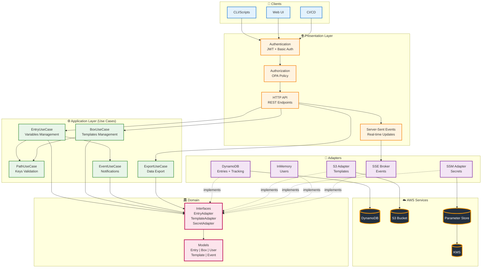
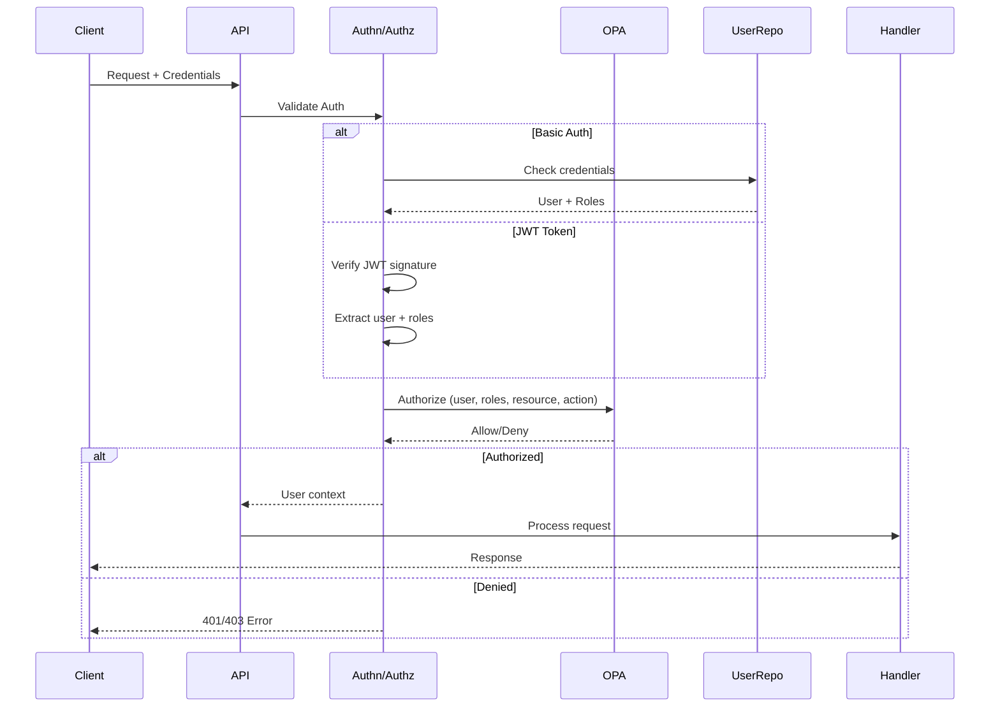
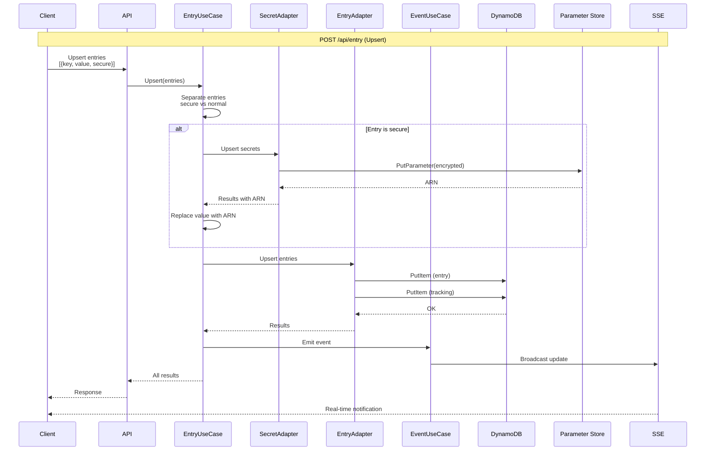
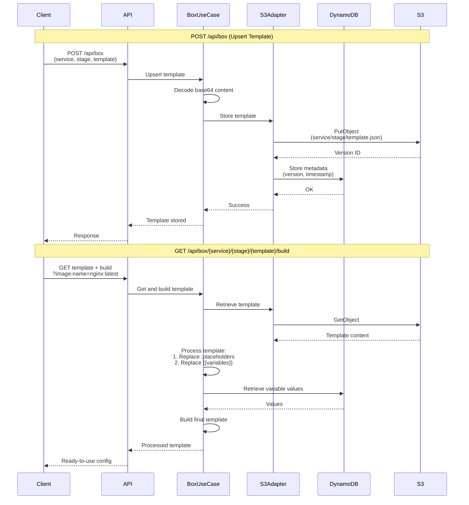
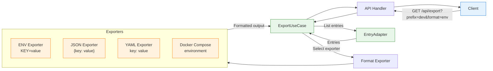
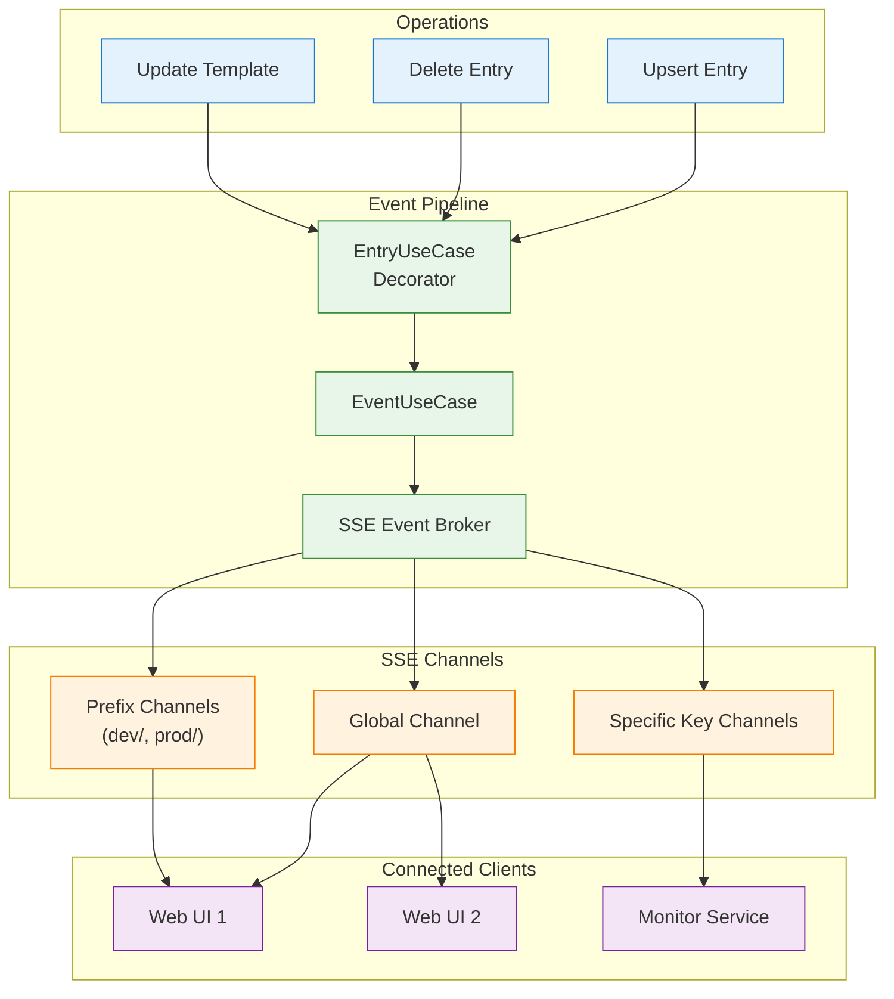
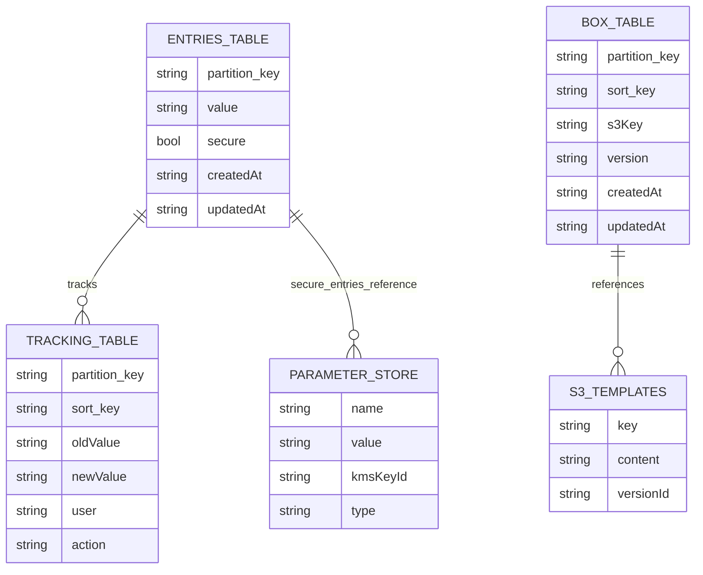
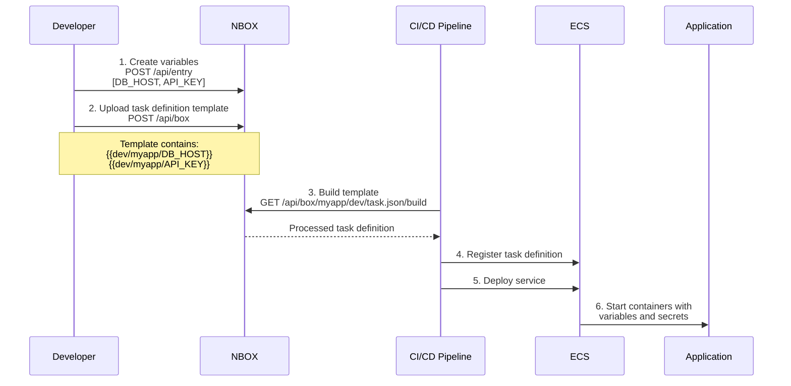
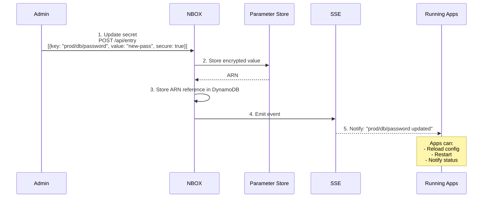
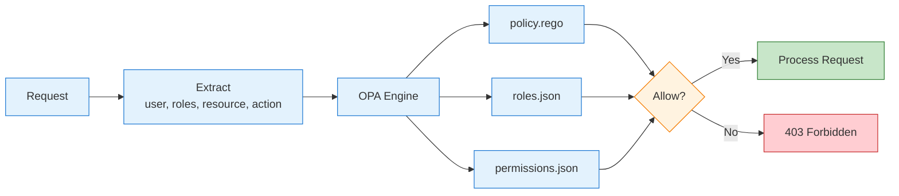

# NBOX Architecture Diagram

## Overview

NBOX is a backend service for centralized management of configurations, environment variables, and secrets. It uses hexagonal architecture (ports and adapters) with native AWS integration.

---

## General Architecture

---

## Authentication and Authorization Flow

**Available Roles:**
- `anonymous`: Public health checks
- `viewer`: Read-only access to non-production environments
- `viewer_prod`: Read-only access including production
- `editor`: Read and write access
- `secrets_reader`: Can read plain values of secrets
- `maintainer`: Can delete entries
- `cicd`: Automation access
- `admin`: Full access

---

## Variables Management Flow (Entries)

**Available Operations:**
- `POST /api/entry`: Create/update variables
- `GET /api/entry/prefix?v=<path>`: List by prefix
- `GET /api/entry/key?v=<key>`: Get specific variable
- `GET /api/entry/secret-value?v=<key>`: Get plain value of secret
- `DELETE /api/entry/key?v=<key>`: Delete variable
- `GET /api/track/key?v=<key>`: Change history

---

## Templates Management Flow

**Available Operations:**
- `POST /api/box`: Create/update template
- `GET /api/box/{service}/{stage}/{template}`: Get raw template
- `GET /api/box/{service}/{stage}/{template}/build`: Get processed template

**Template Processing:**
1. Placeholders `:variable` - Replaced with query params
2. Variables `{{global/example/var}}` - Replaced with values from DynamoDB/SSM

---

## Export Flow

**Supported Formats:**
- `env`: Environment variables (.env)
- `json`: JSON format
- `yaml`: YAML format
- `docker-compose`: For docker-compose.yml

---

## Real-time Event System (SSE)

**SSE Endpoints:**
- `GET /api/events`: Global stream of all events
- `GET /api/events?prefix=dev`: Filtered stream by prefix

---

## Data Storage

---

## Use Cases

### Application Deployment with ECS

### Secrets Rotation

---

## Key Components

### Configuration (Config)
- Loaded from environment variables
- Support for multiple credential strategies
- Configurable environment prefixes

### Path Use Case
- Key validation
- Path normalization
- Allowed prefixes control

### Event System
- Decorator pattern for use cases
- Multi-channel publishing
- SSE support for Web UI

### Health Checks
- AWS connectivity verification
- S3, DynamoDB, SSM status
- Endpoints `/health/ready` and `/health/live`

---

## Security

### Security Layers

1. **Authentication**: HTTP Basic Auth or JWT
2. **Authorization**: OPA (Open Policy Agent) with role-based policies
3. **Encryption**:
   - Secrets encrypted in Parameter Store with KMS
   - TLS in transit (deployment configuration)
4. **Auditing**: Change tracking in DynamoDB table

### OPA Authorization Flow

---

## Endpoints Summary

### Authentication
- `POST /api/auth/token` - Generate JWT token

### Entries (Variables)
- `POST /api/entry` - Create/update variables
- `GET /api/entry/prefix?v=<path>` - List by prefix
- `GET /api/entry/key?v=<key>` - Get variable
- `GET /api/entry/secret-value?v=<key>` - Get secret (plain)
- `DELETE /api/entry/key?v=<key>` - Delete variable
- `GET /api/track/key?v=<key>` - Change history

### Box (Templates)
- `POST /api/box` - Create/update template
- `GET /api/box/{service}/{stage}/{template}` - Get template
- `GET /api/box/{service}/{stage}/{template}/build` - Get processed template

### Export
- `GET /api/export?prefix=<path>&format=<format>` - Export configuration

### Events (SSE)
- `GET /api/events` - Global event stream
- `GET /api/events?prefix=<path>` - Filtered stream

### Health
- `GET /health/ready` - Readiness check
- `GET /health/live` - Liveness check

---

## Technologies Used

- **Language**: Go 1.24+
- **Framework**: Uber FX (Dependency Injection)
- **HTTP**: Native net/http
- **AWS SDK**: aws-sdk-go-v2
- **Logger**: Zap (structured logging)
- **OPA**: Open Policy Agent for authorization
- **Swagger**: OpenAPI documentation
- **Testing**: Go standard testing

